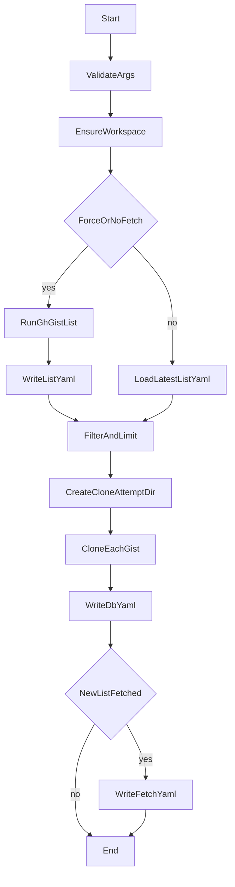

# `clone` サブコマンド 外部仕様書

## 1. 概要

`gistx clone` は、`gh` CLI で認証済みユーザの gist 一覧を取得し、指定条件に合致する gist をローカルへ clone するサブコマンドである。

本仕様では、以下を定義する。

1. `clone` サブコマンドの CLI 外部仕様
2. ユーザディレクトリ配下の保存構造
3. 追加・修正対象クラスの外部仕様
4. 必要な補助関数の外部仕様
5. 永続化ファイル (`fetch.yaml` / `list.yaml` / `progress.yaml`) の形式
6. 例外処理と事後条件

---

## 2. 仕様化にあたっての正規化

要求書には表記ゆれ・誤記があるため、本仕様では以下のように正規化する。

1. 要求書中の `gh repo clone` は gist 用 clone コマンドの誤記とみなし、実行コマンドは `gh gist clone` とする。
2. `gh gist list` には JSON 出力がないため、標準出力テキストを解析して gist 一覧を生成する。
3. `publc` は `public`、`privatec` は `private` として扱う。
4. 「gistlistトップディレクトリは複数個存在してもよい」は、`gistlist` 直下に番号付きディレクトリが複数存在してよい、という意味に正規化する。
5. 既存の `--max_repos` は廃止し、外部仕様は `--max_gists` に統一する。
6. `--force` は clone 実行可否ではなく gist 一覧の再取得可否を制御する。clone 自体は `clone` サブコマンド実行時に常に行う。

---

## 3. 用語とディレクトリ構造

### 3.1 用語

| 用語 | 意味 |
|---|---|
| ユーザ | `gh auth login` で認証された GitHub アカウント |
| ユーザディレクトリ | `AppData\\Local\\gistx\\<user>` |
| list 実行回数 | `gh gist list` を成功実行した累積回数 |
| clone 実行回数 | 同一 `list` スナップショットに対して clone を試行した累積回数 |

### 3.2 ディレクトリ構造

```text
AppData\Local\gistx\
  <user>\
    fetch.yaml
    gistlist\
      <list実行回数>\
        list.yaml
        gistrepo\
          progress.yaml
          <clone実行回数>\
            public\
              <gist名>
            private\
              <gist名>
```

### 3.3 配置ルール

1. `fetch.yaml` はユーザディレクトリ直下に 1 個だけ存在する。
2. `gistlist` はユーザディレクトリ直下に 1 個だけ存在する。
3. `gistlist/<list実行回数>` は、1 回の `gh gist list` 成功実行に対応するスナップショットディレクトリである。
4. `gistrepo/<clone実行回数>` は、同一スナップショットに対する 1 回の clone 試行に対応するディレクトリである。
5. `public` / `private` は clone 実体の格納先ディレクトリである。

---

## 4. 永続化ファイル仕様

### 4.1 `fetch.yaml`

**責務**: `gh gist list` 実行履歴を記録する。

**配置**: `AppData\\Local\\gistx\\<user>\\fetch.yaml`

**形式**: キーを list 実行回数、値を `[実行タイムスタンプ, clone 対象 gist 数]` とする YAML マッピング。

例:

```yaml
1:
  - "2026-03-09 09:00:00"
  - 24
2:
  - "2026-03-10 11:30:00"
  - 8
```

**更新規則**:

1. `gh gist list` が成功したときのみ更新する。
2. キャッシュ済み `list.yaml` を再利用した場合は更新しない。
3. 値の第 2 要素は、その `list` 実行に対して `--public` / `--private` / `--all` と `--max_gists` を適用した結果、今回 clone 対象となった gist 数とする。

### 4.2 `list.yaml`

**責務**: 1 回の `gh gist list` 実行結果を gist 一覧キャッシュとして保存する。

**配置**: `AppData\\Local\\gistx\\<user>\\gistlist\\<list実行回数>\\list.yaml`

**形式**: `gist_id` をキーとする `GistInfo` 連想配列。

`GistInfo` の保持項目:

| 項目 | 型 | 説明 |
|---|---|---|
| `gist_id` | `str` | gist ID |
| `name` | `str` | `gh gist list` から得た gist 名 |
| `public` | `bool` | `True` なら public、`False` なら private/secret |
| `dir_name` | `str` | clone 実行時に確定した格納ディレクトリ名。未確定時は空文字 |

### 4.3 `progress.yaml`

**責務**: 同一 `list` スナップショットに対する clone 実行履歴を記録する。

**配置**: `AppData\\Local\\gistx\\<user>\\gistlist\\<list実行回数>\\gistrepo\\progress.yaml`

**形式**: キーを clone 実行回数、値を実行サマリ辞書とする YAML マッピング。

各サマリ辞書の項目:

| 項目 | 型 | 説明 |
|---|---|---|
| `timestamp` | `str` | clone 開始時刻 |
| `repo_kind` | `str` | `public` / `private` / `all` |
| `requested_count` | `int` | フィルタ適用後の clone 要求数 |
| `success_count` | `int` | clone 成功数 |
| `failure_count` | `int` | clone 失敗数 |
| `list_count` | `int` | 対応する list 実行回数 |

---

## 5. 新設・修正クラス仕様

### 5.1 `AppConfigx`

**ファイル**: `src/gistx/appconfigx.py`

#### 5.1.1 役割

`clone` サブコマンドが利用する DB ファイル・ディレクトリ定義、および設定キー定義を提供する。

#### 5.1.2 追加・修正定数

```python
class AppConfigx(AppConfig):
    BASE_NAME_FETCH = AppConfig.BASE_NAME_FETCH
    BASE_NAME_GISTLIST_TOP = "gistlist"
    BASE_NAME_LIST = "list"
    BASE_NAME_GISTREPO_DB = "db"
    KEY_USER = "user"
    KEY_URL_API = "url_api"
    KEY_GISTS = "gists"
```

#### 5.1.3 要件

1. ユーザディレクトリ配下に `fetch.yaml` と `gistlist` を作成できる定義を持つこと。
2. `list.yaml` と `progress.yaml` は `CommandClone` が実行時に動的パスを解決して出力できること。
3. 既存の `repo` ベース定義に依存しないこと。

---

### 5.2 `Clix`

**ファイル**: `src/gistx/clix.py`

#### 5.2.1 `clone` サブパーサの外部仕様

```python
p_clone = subparsers.add_parser(self.CLONE, help="Clone gists")
```

#### 5.2.2 必須オプション

以下の 3 つは相互排他的な引数グループで定義する。

```python
--public
--private
--all
```

#### 5.2.3 追加オプション

```python
-f, --force
-v, --verbose
--max_gists <int>
```

#### 5.2.4 制約

1. `--public` / `--private` / `--all` は必ず 1 個だけ指定できる。
2. `--max_gists` は正の整数 1 個を取る。
3. `--max_gists` 未指定時は全件 clone とする。
4. `--verbose` 指定時は `logging.DEBUG`、未指定時は `logging.INFO` とする。

---

### 5.3 `Gistx`

**ファイル**: `src/gistx/gistx.py`

#### 5.3.1 `clone`

```python
@classmethod
def clone(cls, args: argparse.Namespace) -> None:
```

#### 5.3.2 責務

1. ログレベルを設定する。
2. `clone` サブコマンド引数の整合性を検証する。
3. `AppStore` を初期化し、必要な設定・DB をロードする。
4. `CommandClone` を生成して `run()` を呼び出す。

#### 5.3.3 事前条件

1. `setup` 済みで `user` 設定が存在すること。
2. `gh auth login` 済みであること。

#### 5.3.4 エラー

1. 可視性オプションが 0 個または複数指定された場合は `ValueError` を送出する。
2. `--max_gists <= 0` の場合は `ValueError` を送出する。

---

### 5.4 `GistInfo`

**ファイル**: `src/gistx/gistinfo.py`

#### 5.4.1 コンストラクタ

```python
class GistInfo:
    def __init__(
        self,
        gist_id: str,
        name: str,
        public: bool,
        dir_name: str = "",
    ) -> None:
```

#### 5.4.2 責務

1. `gh gist list` で取得した gist の最小限の識別情報を保持する。
2. `dir_name` を clone 実行後に保持する。

#### 5.4.3 メソッド

```python
def add_dir_name(self, dir_name: str) -> None:
```

`dir_name` を更新するだけの単純 setter とする。

---

### 5.5 `CommandClone`

**ファイル**: `src/gistx/command_clone.py`

#### 5.5.1 継承

```python
class CommandClone(Command):
```

#### 5.5.2 コンストラクタ

```python
def __init__(self, appstore: AppStore) -> None:
```

#### 5.5.3 保持する主な属性

| 属性 | 型 | 説明 |
|---|---|---|
| `appstore` | `AppStore` | 設定・DB アクセス |
| `user` | `str` | 対象ユーザ名 |
| `args` | `argparse.Namespace | None` | 実行引数 |

#### 5.5.4 パブリックメソッド

##### `run`

```python
def run(self, args: argparse.Namespace, repo_kind: str) -> None:
```

**処理順**:

1. ユーザディレクトリと `fetch.yaml` / `gistlist` の存在を保証する。
2. `--force` または `fetch.yaml` 不在なら `gh gist list` を実行して新しい `list.yaml` を作成する。
3. それ以外は最新の `list.yaml` を読み込む。
4. `repo_kind` と `--max_gists` を適用して clone 対象を決定する。
5. 対象 `list` スナップショット配下に `gistrepo/<clone実行回数>` を作成する。
6. 対象 gist ごとに `public` または `private` 配下へ clone する。
7. `progress.yaml` を更新する。
8. 新しい `gh gist list` を実行した場合のみ `fetch.yaml` を更新する。

#### 5.5.5 プライベートメソッド

##### `_ensure_user_workspace`

```python
def _ensure_user_workspace(self) -> Path:
```

**責務**: ユーザディレクトリ、`fetch.yaml`、`gistlist` を存在保証し、ユーザディレクトリ `Path` を返す。

##### `_should_refresh_list`

```python
def _should_refresh_list(self, fetch_path: Path, force: bool) -> bool:
```

**責務**: gist 一覧を再取得すべきか判定する。

**戻り値**:

- `True`: `force=True` または `fetch.yaml` 不在または最新 `list.yaml` 不在
- `False`: キャッシュ再利用可能

##### `_execute_gh_gist_list`

```python
def _execute_gh_gist_list(self, limit: int) -> str:
```

**責務**: `gh gist list -L <limit>` を実行し、標準出力文字列を返す。

**実行条件**:

- `limit` は 1000 以上の十分大きい固定値を既定とし、1 回で全 gist 取得を試みる。

##### `_create_list_snapshot`

```python
def _create_list_snapshot(self, gistlist_top_dir: Path, stdout: str) -> tuple[int, dict[str, GistInfo]]:
```

**責務**:

1. `stdout` を解析して `dict[str, GistInfo]` を生成する。
2. 次の `list実行回数` を採番する。
3. `gistlist/<list実行回数>/list.yaml` を作成する。
4. 生成した回数と連想配列を返す。

##### `_load_latest_list_snapshot`

```python
def _load_latest_list_snapshot(self, gistlist_top_dir: Path) -> tuple[int, dict[str, GistInfo]]:
```

**責務**: `gistlist` 直下で最大の番号ディレクトリを見つけ、その `list.yaml` を読み込む。

##### `_filter_gists`

```python
def _filter_gists(
    self,
    gist_info_assoc: dict[str, GistInfo],
    repo_kind: str,
) -> list[GistInfo]:
```

**責務**:

1. `repo_kind == "public"` なら public のみ返す。
2. `repo_kind == "private"` なら private/secret のみ返す。
3. `repo_kind == "all"` なら全件返す。

##### `_limit_gists`

```python
def _limit_gists(self, gist_infos: list[GistInfo], max_gists: int | None) -> list[GistInfo]:
```

**責務**: `max_gists` 指定時は先頭からその件数に切り詰める。

##### `_get_next_clone_count`

```python
def _get_next_clone_count(self, gistrepo_top_dir: Path) -> int:
```

**責務**: `gistrepo` 直下の数字名ディレクトリから次の clone 実行回数を返す。

##### `_clone_gists`

```python
def _clone_gists(
    self,
    gist_infos: list[GistInfo],
    clone_dir: Path,
) -> tuple[int, int]:
```

**責務**:

1. gist ごとに格納先を決定する。
2. `gh gist clone <gist_id> <target_dir>` を実行する。
3. 成功数と失敗数を返す。

##### `_write_fetch_yaml`

```python
def _write_fetch_yaml(
    self,
    fetch_path: Path,
    list_count: int,
    timestamp: str,
    clone_target_count: int,
) -> None:
```

**責務**: `fetch.yaml` に list 実行履歴を追記する。

##### `_write_clone_db_yaml`

```python
def _write_clone_db_yaml(
    self,
    db_path: Path,
    clone_count: int,
    summary: dict[str, object],
) -> None:
```

**責務**: `progress.yaml` に clone 実行サマリを追記する。

---

## 6. クラス外関数仕様

### 6.1 `parse_gh_gist_list_output`

```python
def parse_gh_gist_list_output(stdout: str) -> dict[str, GistInfo]:
```

**責務**:

1. `gh gist list` の標準出力を 1 行ずつ解析する。
2. gist ID、gist 名、可視性を抽出する。
3. `gist_id` をキーに `GistInfo` 連想配列を返す。

**備考**:

- ヘッダ行・空行は無視する。
- 解析不能な行が存在する場合は `ValueError` を送出する。

### 6.2 `sanitize_gist_name`

```python
def sanitize_gist_name(name: str) -> str:
```

**責務**:

1. Windows ファイルシステムで使用不可な文字を `_` に置換する。
2. 前後空白を除去する。
3. 空文字になった場合は `_none` を返す。

### 6.3 `make_unique_dir_name`

```python
def make_unique_dir_name(base_name: str, used_names: set[str]) -> str:
```

**責務**:

1. 同一 `clone` 実行内で重複しないディレクトリ名を返す。
2. `base_name` が未使用ならそのまま返す。
3. 使用済みなら `-1`, `-2`, ... を付与する。

---

## 7. CLI オプション仕様

### 7.1 コマンド形式

```bash
gistx clone (--public | --private | --all) [--max_gists N] [-f] [-v]
```

### 7.2 オプション意味

| オプション | 意味 |
|---|---|
| `--public` | public gist のみ clone |
| `--private` | private/secret gist のみ clone |
| `--all` | public/private の両方を clone |
| `--max_gists N` | clone 対象 gist 数の上限 |
| `-f`, `--force` | `gh gist list` を強制再実行し、新しい `list.yaml` を作る |
| `-v`, `--verbose` | ログレベルを `DEBUG` にする |

### 7.3 オプション解決順

1. 可視性フィルタを適用する。
2. `--max_gists` を適用する。
3. 決定した件数を clone 対象件数とする。

---

## 8. 実行シーケンス



---

## 9. エラー処理

| 状況 | 挙動 |
|---|---|
| `--public` / `--private` / `--all` の指定数が 1 でない | `ValueError` |
| `--max_gists <= 0` | `ValueError` |
| `gh` コマンドが存在しない | `FileNotFoundError` または `subprocess` 例外を伝播 |
| `gh gist list` 失敗 | `RuntimeError` を送出し、`fetch.yaml` を更新しない |
| `gh gist list` 出力解析失敗 | `ValueError` |
| 最新 `list.yaml` が存在しない | `--force` 相当で再取得する |
| 個別 gist clone 失敗 | 当該 gist を失敗として記録し、残りは継続する |
| `progress.yaml` / `list.yaml` / `fetch.yaml` 出力失敗 | 例外をそのまま送出する |

---

## 10. 事後条件

1. `clone` 成功後、対象 `gistrepo/<clone実行回数>` は存在する。
2. 成功した gist は対応する `public` または `private` 配下に clone されている。
3. `progress.yaml` には当該 clone 実行のサマリが追記されている。
4. 新規に `gh gist list` を実行した場合のみ、`fetch.yaml` と `list.yaml` が更新される。

---

## 11. 使用例

```bash
gistx clone --public
gistx clone --private --max_gists 5
gistx clone --all -f -v
```

---

## 12. 既存ファイルの変更対象まとめ

| ファイル | 変更内容 |
|---|---|
| `src/gistx/appconfigx.py` | `gistlist` / `fetch` / `db` 関連定義を追加・整理 |
| `src/gistx/clix.py` | `clone` オプションを `--max_gists` 中心に再定義し、排他制約を導入 |
| `src/gistx/gistx.py` | ログレベル設定、引数検証、`CommandClone` 呼び出し整理 |
| `src/gistx/gistinfo.py` | gist 一覧キャッシュ用の最小属性へ整理 |
| `src/gistx/command_clone.py` | `gh gist list` / `gh gist clone` ベースの処理へ再設計 |

